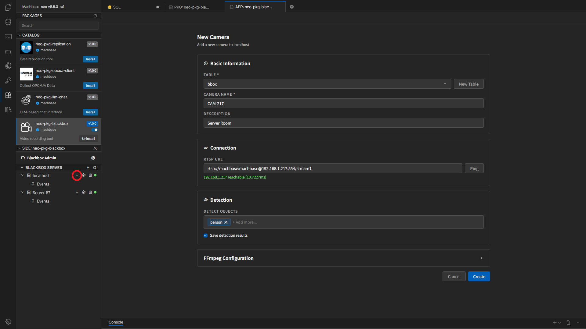
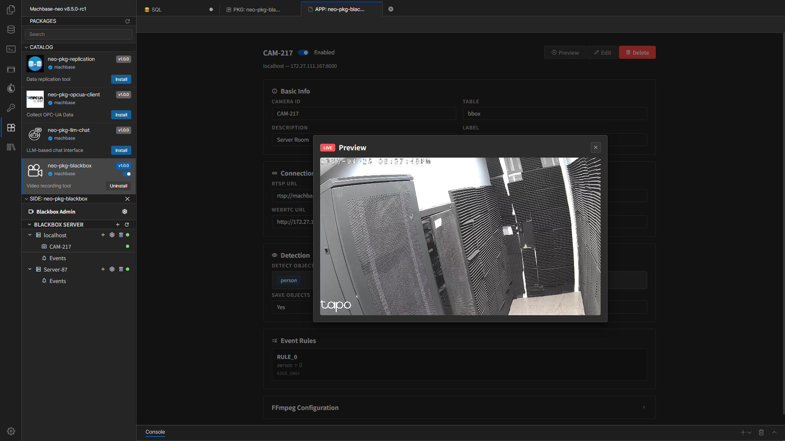

# Camera Management

After registering a Blackbox Server, you can add and operate cameras under each server.

## Adding a New Camera

Expand the target server in the sidebar and select **Add Camera** to open the new Camera screen.

The main fields in the new Camera screen are:

- `Table`
  - The table where camera-related data is stored
- `Camera Name`
  - The camera name
- `Description`
  - A description
- `RTSP URL`
  - The actual camera stream address

If the `Table` list is empty, you can create a new table with the **New Table** button.

## Checking the RTSP Connection

After entering the RTSP URL, you can use the **Ping** button to check whether the target device is reachable.

- On success: a reachable message is shown
- On failure: an unreachable or ping failure message is shown

Even if Ping succeeds, recording can still fail if the credentials or stream path are wrong, so verify the actual runtime status after saving.

## Detection Settings

In the Detection section, you can choose which objects to detect.

- `Detect Objects`
  - The list of target objects to detect
- `Save detection results`
  - Whether to store detection results

The object names used in Event Rules are based on this `Detect Objects` list.

If you do not use object detection, this section can be left empty.

## FFmpeg Settings

You can adjust FFmpeg settings for each camera separately.

- You can keep the defaults.
- If a specific camera needs custom options, configure them here.
- Output or retention paths can also be set differently per camera.

## Event Rules

In the existing Camera edit screen, you can configure the Event Rule section.

This section defines rules that create an event when certain conditions are met based on detection results.

In rule expressions, it is best to use only the object names registered in the current camera's `Detect Objects`.  
In the Event Rule editor, this list appears as `Idents`, and you can click an item to insert it directly into the expression.

Examples:

- `person > 0`
  - Generates an event when at least one person is detected
- `car >= 2`
  - Generates an event when two or more cars are detected
- `person > 0 && car > 0`
  - Generates an event when a person and a car are detected together

Names such as `person` and `car` should be objects already registered in Detection.  
It is safer to configure `Detect Objects` first and then add Event Rules.

Instead of starting with complex rules immediately, it is more stable to confirm that Detection itself works first and then add rules.

## Camera Detail Screen

When you open an existing camera, you can review the following information.

- Camera name
- Status switch
- Table
- Description
- RTSP URL
- Detection settings
- FFmpeg settings
- Live Preview

A running camera shows the status switch as `Enabled`.

## Starting and Stopping a Camera

Use the status switch at the top of the detail screen to enable or disable the camera.

- `Enabled`
  - The camera is running
- `Disabled`
  - The camera is stopped

After changing settings, it is a good idea to disable and re-enable the camera to verify that the changes are applied.

## Editing and Deleting a Camera

- `Edit`
  - Updates Description, RTSP URL, Detection, FFmpeg, and similar settings
- `Delete`
  - Deletes the camera

Deleting a camera cannot be undone. For a camera in operation, it is safer to disable it first and check the impact before deleting it.

## Navigation

- [Previous: Settings and Server Registration](./settings-and-servers.en.md)
- [Back to Index](./index.en.md)
- [Next: Event Monitoring](./event-monitoring.en.md)
