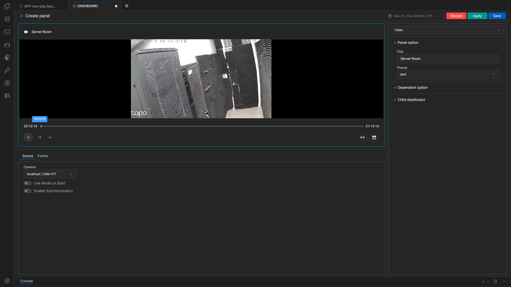
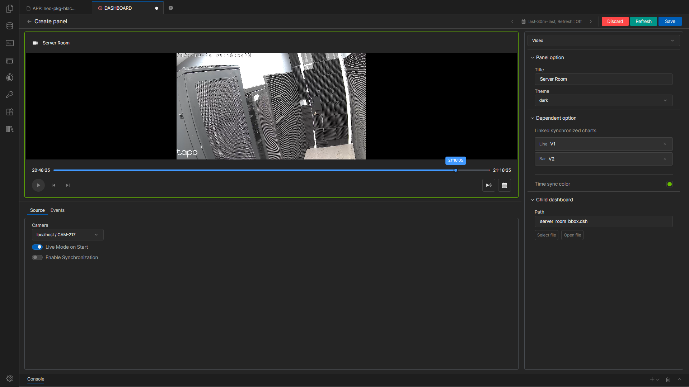
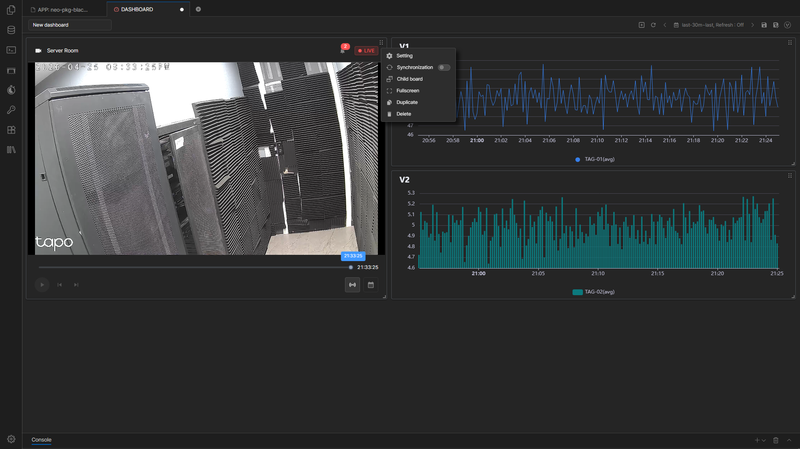
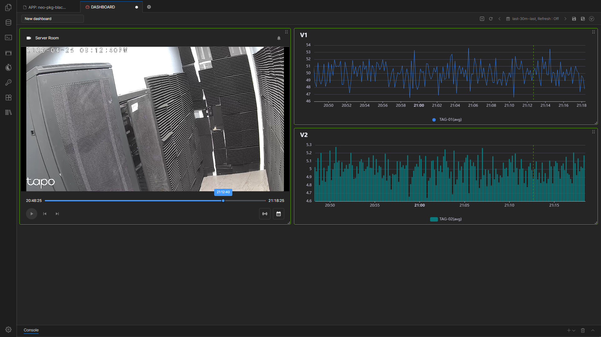
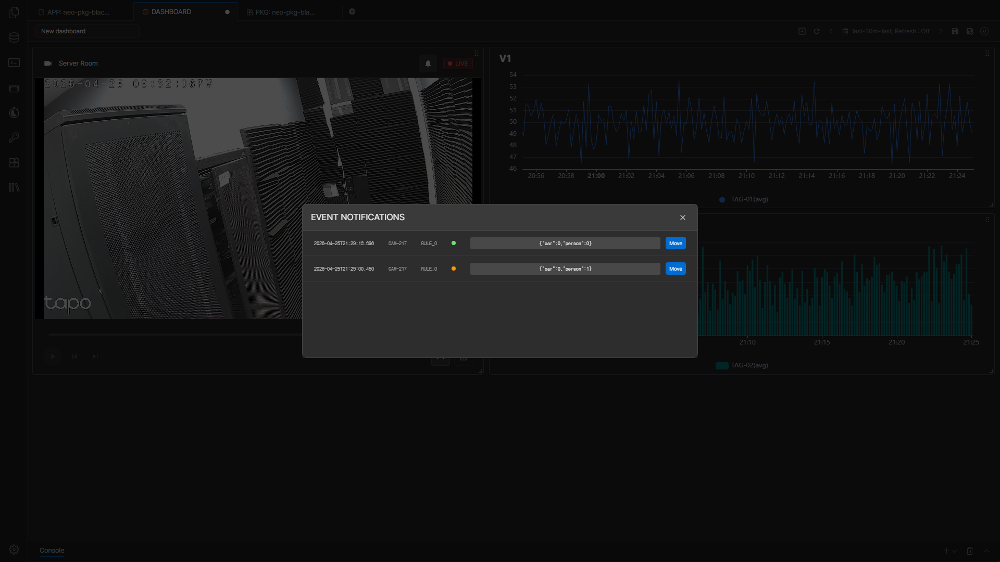

# 대시보드 Video 패널 사용

`neo-pkg-blackbox`가 설치되면 Neo Web 대시보드에서 패널 생성 시 `Type = Video`를 선택할 수 있습니다.

이 패널을 사용하면 등록된 Camera 영상을 대시보드 안에서 조회하고, 차트 패널과 시간 표시를 연동하거나 child dashboard를 연결할 수 있습니다.

## 시작 전 확인

- Blackbox 패키지가 설치되어 있어야 합니다.
- Blackbox Server와 Camera가 이미 등록되어 있어야 합니다.
- 대시보드에서 사용할 Camera는 먼저 정상 연결과 조회가 가능한 상태인지 확인하는 편이 좋습니다.

## Video 패널 생성

1. Neo Web에서 원하는 대시보드를 엽니다.
2. 패널 추가 화면을 엽니다.
3. `Type`에서 `Video`를 선택합니다.
4. 좌측의 `Source`, `Events` 탭과 우측 옵션 패널을 순서대로 설정합니다.
5. **Apply** 또는 **Save**로 저장합니다.

## Source 탭

`Source` 탭에서는 기본 영상 조회 동작을 정합니다.

- `Camera`
  - 이 Video 패널에서 조회할 Camera를 선택합니다.
- `Live Mode on Start`
  - 대시보드를 열 때 이 패널이 바로 Live 모드로 시작되게 합니다.
- `Enable Synchronization`
  - Video 패널 간 시간 동기화 기능을 사용할 수 있게 합니다.

## Events 탭

`Events` 탭에서는 Camera 관리 화면과 같은 방식으로 이벤트 관련 설정을 사용할 수 있습니다.

- `Camera`
  - 이벤트 설정에 사용할 Camera를 선택합니다.
- `Detection`
  - 감지할 객체를 선택합니다.
- `Event Rule`
  - Detection 결과를 기준으로 이벤트 발생 조건을 등록합니다.

예를 들어 `person > 0`, `car >= 2`, `person > 0 AND car > 0` 같은 식을 사용할 수 있습니다.  
규칙 식에는 현재 Camera의 Detection에 등록된 객체만 사용하는 것이 좋습니다.

## 우측 옵션 패널

우측 옵션 패널에서는 Video 패널과 함께 동작할 대시보드 옵션을 설정합니다.

### Dependent option

`Dependent option`에서는 동기화 표시를 적용할 차트 패널을 선택합니다.

- 현재 대시보드 안에 있는 차트 패널만 선택할 수 있습니다.
- 선택 가능한 대상은 `Line`, `Bar`, `Scatter` 타입입니다.
- 기준은 X축에 시간 라인을 둘 수 있는 차트입니다.
- 차트 패널을 선택하면 해당 차트에는 Video 패널의 현재 시각 위치가 세로 점선으로 표시됩니다.
- `Time sync color`에서 이 세로선의 색상을 정할 수 있습니다.

### Child dashboard

`Child dashboard`에서는 연결할 하위 대시보드를 지정합니다.

- `Path`에 대시보드 경로를 직접 입력할 수 있습니다.
- 선택 버튼으로 대시보드를 고를 수 있습니다.
- 열기 버튼으로 연결할 대시보드를 바로 확인할 수 있습니다.

child dashboard가 등록되면 Video 패널 헤더 메뉴의 `Child board` 항목에서 해당 대시보드를 새 창으로 열 수 있습니다.

## 패널 헤더 메뉴

Video 패널 헤더 메뉴에서는 다음 기능을 사용할 수 있습니다.

- `Synchronization`
  - 패널 동기화를 켜거나 끕니다.
  - 같은 대시보드 안에서 동기화가 켜진 Video 패널들은 시간 범위, 재생 위치, 재생/일시정지 상태를 함께 맞출 수 있습니다.
- `Child board`
  - 연결된 child dashboard를 새 창으로 엽니다.
- `Fullscreen`
  - Video 패널을 전체 화면으로 엽니다.

동기화는 주로 녹화 영상 조회 구간에서 사용하는 기능으로 보는 것이 좋습니다.

## 패널 하단 버튼과 타임라인

Video 패널 아래쪽에는 조회와 탐색에 필요한 버튼이 표시됩니다.

- `Live`
  - 실시간 영상 조회를 시작하거나 중지합니다.
- `Time Range`
  - 조회할 영상의 시간 범위를 설정합니다.
- 재생 타임라인
  - 선택한 시간 범위 안에서 현재 위치를 보여주고 원하는 시점으로 이동할 수 있습니다.

선택한 시간 범위 안에 영상 데이터가 없는 구간은 재생 타임라인에 붉은색 구간으로 표시됩니다.

`Time Range`는 Live 모드에서는 사용할 수 없습니다.

## 이벤트 알림과 확인

현재 조회 중인 시간 범위 안에 이벤트가 있으면 패널 상단의 이벤트 알림 아이콘에 개수가 표시됩니다.

- 표시 개수는 많을 때 `99+` 형태로 축약될 수 있습니다.
- 아이콘을 클릭하면 이벤트 목록을 열 수 있습니다.
- 목록에서 이벤트를 선택하면 해당 시점으로 이동해 영상을 확인할 수 있습니다.

## 운영 팁

- 먼저 Camera 하나로 영상 조회가 정상인지 확인한 뒤 차트 연동과 child dashboard를 추가하는 편이 안전합니다.
- 동기화와 차트 세로선 표시를 함께 쓰면 영상 시점과 데이터 시점을 비교하기 쉽습니다.
- 이벤트가 많을 때는 먼저 시간 범위를 좁힌 뒤 패널에서 이벤트 목록을 확인하는 편이 편합니다.

## 문서 이동

- [이전: 카메라 관리](./camera-management.kr.md)
- [목차로 돌아가기](./index.kr.md)
- [다음: 이벤트 조회](./event-monitoring.kr.md)
