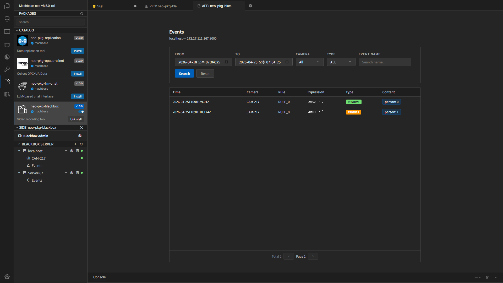

# Event Monitoring

In the Event screen of the Blackbox package, you can review detection results and rule evaluation results by time range.

## Opening the Event Screen

Select **Events** under a server in the sidebar to open the Event screen.

## Search Filters

The Event screen lets you narrow the search range with the following filters.

- `From`
- `To`
- `Camera`
- `Type`
- `Event Name`

`Type` usually shows values such as:

- `ALL`
- `MATCH`
- `TRIGGER`
- `RESOLVE`
- `ERROR`

## Search Flow

1. Enter the time range.
2. Select Camera or Type if needed.
3. Click **Search** to load the results.
4. Use **Reset** if you want to clear the filters.

## Items in the Result Table

Main columns:

- `Time`
- `Camera`
- `Rule`
- `Expression`
- `Type`
- `Content`

`Content` may show summary information such as detected object counts in badge form.

## Viewing Event Details

Click a row in the table to open the event detail view.

There you can review:

- The event timestamp
- Camera ID
- Rule name
- The expression used
- Detailed detection results

## Operational Checks

- If the expected rule never appears, review the Detection settings first.
- If `ERROR` events repeat, check the camera connection or server status before anything else.
- If the time range is too narrow, it may look like there are no events, so it is usually better to start with a wider range.

## Navigation

- [Previous: Camera Management](./camera-management.en.md)
- [Back to Index](./index.en.md)
- [Next: Troubleshooting](./troubleshooting.en.md)
