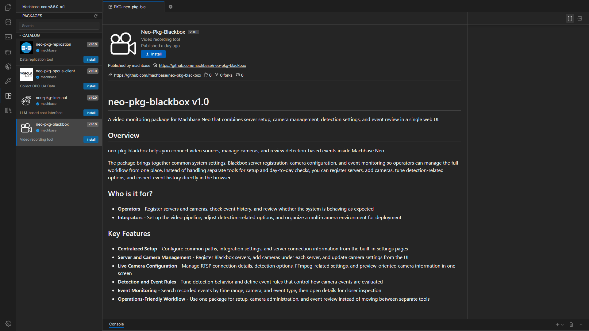
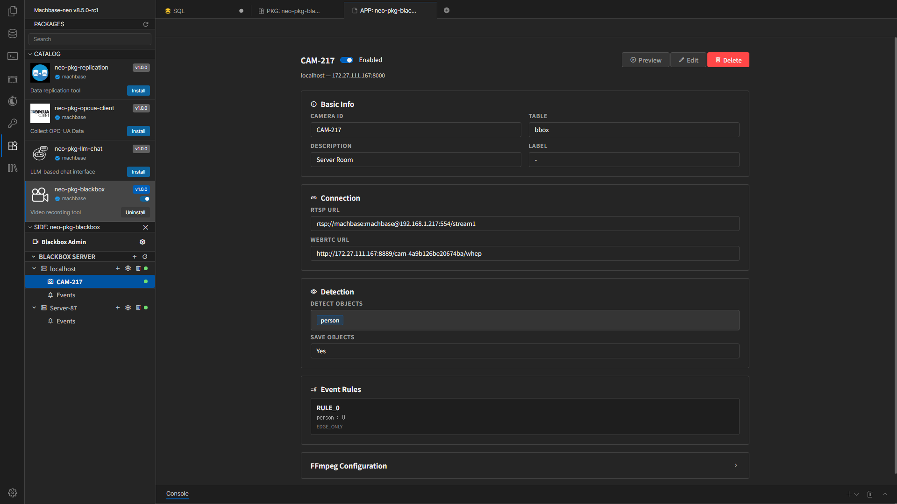

# Blackbox User Manual

This document explains how to install the **Machbase Neo Blackbox package**, register servers, manage cameras, and review events.

## Installation

The left sidebar in Machbase Neo shows the list of available packages.  
Select the Blackbox package there and click the `Install` button to install it.

Installation may take a short time, so wait until it finishes.

## What This Document Covers

- Package installation
- Saving common settings in the Settings screen
- Registering a Blackbox Server and testing the connection
- Adding and editing cameras
- Creating and using Video panels in Neo dashboards
- Searching and reviewing events in the Event screen
- Common operational checks and troubleshooting points

## Basic Workflow

1. Install the Blackbox package in Neo.
2. Review the common paths and integration settings in Settings.
3. If a localhost server is auto-registered during the first installation, change `127.0.0.1` to an IP address reachable from other computers.
4. Add more **Blackbox Server** entries in the left sidebar if needed.
5. Add cameras under each server.
6. Adjust Detection, FFmpeg, and Event Rules if needed.
7. If needed, add a `Video` panel in a Neo dashboard and review camera video there.
8. Review event history in the Event screen.

## Screen Layout

- Left sidebar: Blackbox Server list, Camera list, Events entry, add server, refresh
- Top Settings tabs: General, FFmpeg Default, Log Configuration
- Camera screen: basic information, RTSP connection, Detection, FFmpeg, Event Rules, Live Preview
- Event screen: search by time range, camera, type, and review details

## Document List

- [Settings and Server Registration](./settings-and-servers.en.md)
- [Camera Management](./camera-management.en.md)
- [Using Dashboard Video Panels](./dashboard-video-panel.en.md)
- [Event Monitoring](./event-monitoring.en.md)
- [Troubleshooting](./troubleshooting.en.md)

## Navigation

- [Next: Settings and Server Registration](./settings-and-servers.en.md)
