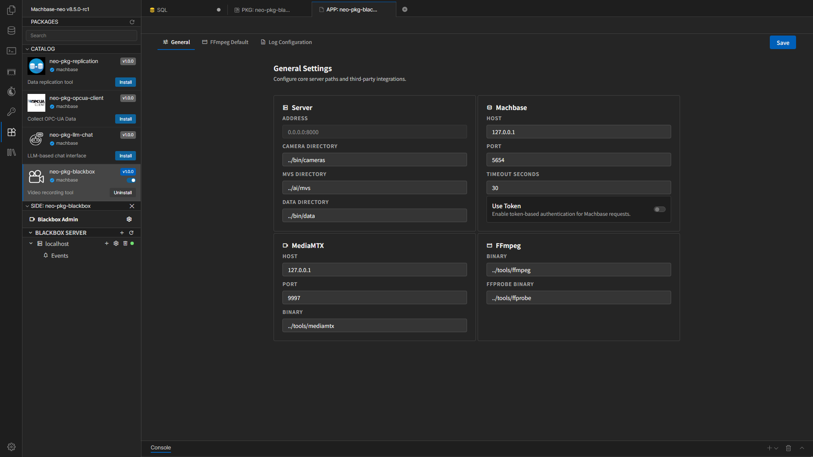
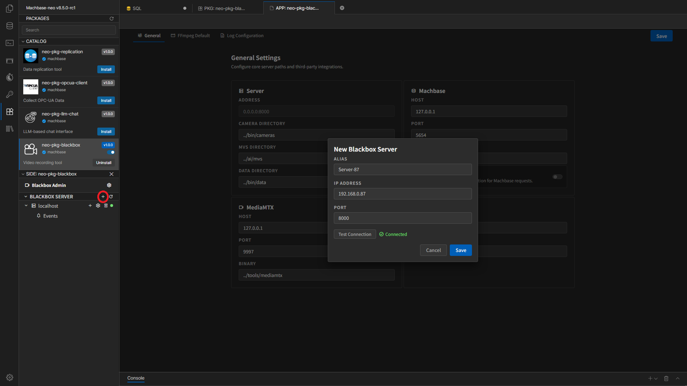
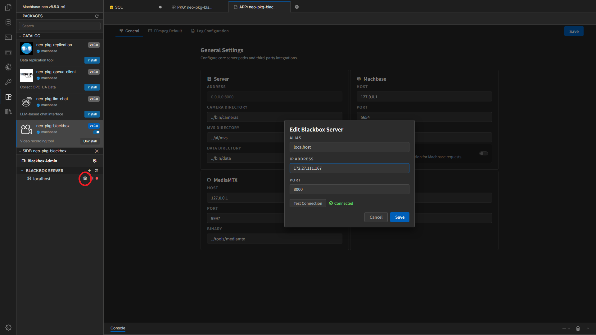

# Settings와 서버 등록

Blackbox 패키지는 먼저 **공통 설정(Settings)** 을 확인한 뒤, 실제로 연결할 **Blackbox Server**를 등록하는 순서로 사용하는 것이 좋습니다.

## Settings 화면

상단의 Settings 화면은 세 개의 탭으로 구성됩니다.

- `General`
- `FFmpeg Default`
- `Log Configuration`

오른쪽 상단의 **Save** 버튼을 눌러 변경 내용을 저장합니다.

## General 탭

General 탭에서는 패키지 전체가 공통으로 사용하는 연결 정보와 경로를 설정합니다.

주요 항목:

- `Address`
  - Blackbox 서버가 수신 대기할 주소와 포트입니다.
- `Camera Directory`
  - 카메라 설정 파일이 저장되는 경로입니다.
- `MVS Directory`
  - AI 관련 모델 또는 보조 파일 경로입니다.
- `Data Directory`
  - 영상 또는 관련 데이터가 저장되는 경로입니다.
- `Machbase`
  - Machbase Neo와 통신할 Host, Port, Timeout Seconds를 설정합니다.
  - 필요하면 `Use Token`을 켜서 토큰 기반 인증을 사용할 수 있습니다.
- `MediaMTX`
  - MediaMTX의 Host, Port, Binary 경로를 설정합니다.
- `FFmpeg / FFprobe Binary`
  - FFmpeg와 FFprobe 실행 파일 경로를 지정합니다.

일반 사용자는 보통 설치 후 기본값을 유지하고, 실제 운영 환경에 맞춰 주소와 경로만 점검하면 충분합니다.

## FFmpeg Default 탭

이 탭은 FFmpeg 또는 ffprobe의 기본 인수를 관리하는 화면입니다.

- 기본 probe 옵션을 추가할 수 있습니다.
- 기존 항목을 수정하거나 삭제할 수 있습니다.
- 영상 분석이나 메타데이터 조회 규칙을 공통으로 맞추고 싶을 때 사용합니다.

운영 중 특별한 요구가 없다면 기본값을 먼저 사용하고, 문제 분석이 필요할 때만 조정하는 편이 안전합니다.

## Log Configuration 탭

이 탭에서는 패키지 전체의 로그 정책을 정합니다.

주요 항목:

- `Log Directory`
- `Log Level`
- `Log Format`
- `Output Destination`
- `Filename Pattern`
- `Max File Size`
- `Max Backups`
- `Max Age`
- `Compress Old Logs`

권장 사항:

- 일반 운영: `info` 또는 `warn`
- 장애 분석: 일시적으로 `debug`

`debug` 수준은 로그가 빠르게 늘 수 있으므로 장기간 유지하지 않는 편이 좋습니다.

## 설정 저장 후 확인

각 Settings 탭의 오른쪽 상단 **Save** 버튼을 누르면 변경 사항이 저장됩니다.

- 경로나 바이너리 설정을 바꾼 뒤에는 실제 Camera 동작을 다시 확인합니다.
- 설치 경로나 실행 파일 경로를 바꾼 경우에는 재시작이나 재적용이 필요할 수 있습니다.
- 운영 환경에서는 저장 직후 서버 연결, 카메라 상태, 로그 생성 여부까지 함께 확인하는 편이 안전합니다.

## Blackbox Server 등록

좌측 사이드바의 **BLACKBOX SERVER** 영역에서 `+` 버튼을 누르면 새 서버를 등록할 수 있습니다.

입력 항목:

- `Alias`
  - 화면에서 구분할 서버 이름
- `IP Address`
  - 실제 Blackbox Server 주소
- `Port`
  - 해당 서버 포트

등록 순서:

1. `+` 버튼 클릭
2. Alias, IP, Port 입력
3. 가능하면 **Test Connection**으로 먼저 연결 확인
4. **Save**로 저장

## 최초 설치 후 localhost 서버 확인

최초 설치 시에는 localhost 서버가 자동으로 등록될 수 있습니다.

- 이 서버의 기본 IP는 `127.0.0.1`입니다.
- 이 값을 그대로 두면 같은 컴퓨터에서만 접속할 수 있습니다.
- 다른 컴퓨터에서 이 Blackbox Server를 사용해야 하면 외부에서 접속 가능한 실제 IP로 바꿔야 합니다.

권장 순서:

1. 자동 등록된 localhost 서버를 엽니다.
2. `IP Address`가 `127.0.0.1`인지 확인합니다.
3. 다른 컴퓨터에서 접근 가능한 서버 IP로 변경합니다.
4. **Test Connection**으로 다시 확인합니다.
5. **Save**로 저장합니다.

## 등록된 서버 관리

사이드바에서 서버별로 다음 동작을 수행할 수 있습니다.

- `Refresh`
  - 서버 목록과 카메라 상태를 다시 불러옵니다.
- `Settings`
  - 서버 정보를 수정합니다.
- `Delete`
  - 서버를 삭제합니다.

연결에 실패하면 사이드바에서 오류 상태가 보일 수 있으므로 IP, Port, 서버 프로세스를 다시 확인합니다.

서버를 삭제하면 그 서버에 속한 카메라 화면 접근도 불가능해질 수 있으므로, 운영 중에는 신중하게 사용해야 합니다.

## 사용자 주의사항

- Settings의 공통 경로와 서버별 IP/Port는 서로 다른 목적입니다.
- MediaMTX, FFmpeg, Machbase 주소가 잘못되면 Camera가 정상 등록되어도 실제 동작이 실패할 수 있습니다.
- 처음에는 서버 1개와 카메라 1개만 등록해 정상 동작을 확인한 뒤 확장하는 것이 좋습니다.

## 문서 이동

- [목차로 돌아가기](./index.kr.md)
- [다음: 카메라 관리](./camera-management.kr.md)
